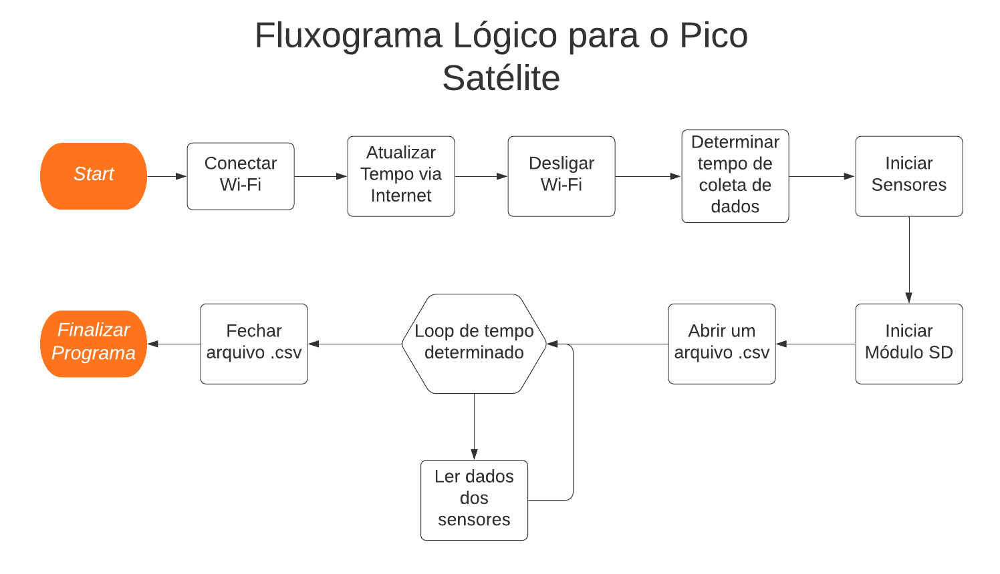

# Pico-Satellites-PIBITI-2019-2020
Neste repositório é apresentado parte de um projeto associado a Iniciação Científica, com bolsa PIBITI, através do CNPq que se iniciou em agosto de 2019, a qual têm o objetivo de analisar abordagens da ciência espacial e tecnológica no ensino de ciências, com ênfase em física aeroespacial, envolvendo alunos da Educação Básica (Ensino Fundamental e Médio) da rede pública das cidades do Litoral Norte, do Estado de São Paulo, Brasil. Os  principais temas abordados no projeto são os pico-satélites e a física aplicada ao  desenvolvimento de satélites, sondas e foguetes, com ênfase na evolução histórica dos conhecimentos associados à Física Espacial e à Astronáutica. Em paralelo, foi construído um protótipo de pico-satélite partindo da tecnologia de embarcado (microcontroladores, tais como o arduino), aplicando-os diretamente na produção do protótipo do pico-satélites (cujo repositório está apresentado aqui). O modelo a ser confeccionado será um CanSat, palavra com união dos termos “can” (“lata” em inglês) e “sat” (abreviação da palavra “satélite” em inglês), ou seja, um satélite em uma lata de refrigerante.

## Começando

O objetivo desse satélite é ser acessível para que qualquer um possa confeccioná-lo, portanto, seu desenho e seu material foi pensado para ser de baixo custo. O objeto é composto por cinco partes, na quais são: microcontrolador; sensores; datalogger (registrador de dados); alimentação; estrutura.
Para o microcontrolador, foi utilizado o ESP32 DevKit Doit com 30 pinos, como mostra na figura 1, item a. Não foi escolhido apenas pelo hardware, mas sim por ele ter Wi-Fi e RTC (Real Time Clock ou Relógio de Tempo Real em português) integrado ao seu circuito, módulos que acrescentando a parte sairiam muito mais caro, perdendo um dos conceitos de ser de baixo custo, além de ocupar mais espaço.
   
   Os sensores utilizados no projeto, são: BME280, capaz de detectar pressão, altitude, temperatura e umidade (Figura 1, item d); MPU6050, sensor de acelerômetro e giroscópio, captando 3 valores de eixo para cada tipo, ele também tem em seu sistema um detector de temperatura, totalizando sete valores de saídas (Figura 1, item c).
   
   Foi escolhido utilizar um datalogger ao invés de um transmissor de radiofrequência, isso porque, para receber o dados, seria necessário um outro microcontrolador. Para armazenar os dados, foi empregado um módulo de cartão micro SD (Figura 1, item b), no qual os dados são salvos em um arquivo de planilha com extensão .csv (Comma-separated values, traduzido para o português fica valores separados por vírgula).
   
   Para ligar todo esse circuito, foi utilizado uma bateria convencional de 9V, porém a alimentação externa do ESP32 é de 5V, ou seja, menor, contudo, foi realizada um mini conversor DC/DC step down (Figura 1, item e), que diminui a tensão de entrada.

| Figura 1: Relação dos componentes com uma moeda de um real. | Figura 2: Camadas do Circuito. |
|:---:|:---:|
|  |  |
| (a) ESP32;  (b) Módulo de cartão micro SD;  (c) Sensor MPU6050;  (d) Sensor BME280;  (e) Mini conversor DC/DC step down.| (a) camada para conectar o ESP32;  (a.2) placa com o ESP32 conectado;  (b) Circuito para os sensores e módulo de cartão micro SD;  (b.2) Placa com os componentes.|

Para unificar todo esse sistema, foi utilizada placas de circuito impresso ilhada de fibra de vidro, no qual foi soldada barras de pino de entrada fêmea para conectar os componentes. o protótipo tem três camadas, onde a primeira camada de baixo para cima, se encontra a bateria, na camada superior, fica o microcontrolador e o step down (Figura 2, item a), e na última camada, fica os dois sensores junto do módulo de cartão micro SD (Figura 2, item b). Essa estrutura (Figura 3), fica dentro de uma latinha de alumínio com volume de 350ml (Figura 4).

| Figura 3: Estrutura dos componentes. | Figura 4: Estrutura dentro da lata de alumínio. |
|:---:|:---:|
|  |  |

O microcontrolador necessita de um programado para executar sua função, neste caso, seu programa foi feito na linguagem do arduino, no qual tem a mesma estrutura que a linguagem C/C++. Para não sobrecarregar o relatório de linhas de código, será explicado apenas o conceito lógico. Sua lógica é simples, ela segue os passos do fluxograma da Figura 5, onde irá utilizar o seu módulo interno de Wi-Fi para atualizar seu RTC, no qual será além de ser comparado com o tempo pré determinado, ele irá ser salvo também no arquivo .csv, sendo utilizado na análise de dados.

| Figura 5: Fluxograma lógico para o Pico Satélite. |
|:---:|
|  |

Para finalizar a experimentação do cansat, é necessário fazer a análise dos dados, para tanto, o arquivo .csv pode ser lido em algum software de planilha (Excel, google planilhas) ou em outro meio de análise de dados. No caso deste projeto, foi utilizado a segunda opção, na qual utilizando a linguagem de Python, foi feito uma relação entre os dados e plotando gráficos, como temperatura em função do tempo, umidade em função do tempo, etc. O código fonte deste programa de análise de dados, também está no repositório do Github do bolsista.

## Autores

* **Yeté Abunã Marques Labarca** - *Autor* - [*Github*](https://github.com/SaruMan64) - [*CV*](http://lattes.cnpq.br/4293840717688049)
* **Ricardo Roberto Plaza Teixeira** - *Orientador* - [*CV*](http://lattes.cnpq.br/3547496765385198)

## Licença

Este projeto está licenciado sob a licença MIT - veja o arquivo [LICENSE.md](LICENSE.md) para obter detalhes.

## Agradecimentos

Agradecemos ao CNPq pela bolsa PIBITI e ao IFSP - Caraguatatuba e às escolas em que foram realizadas as atividades de divulgação científica.

